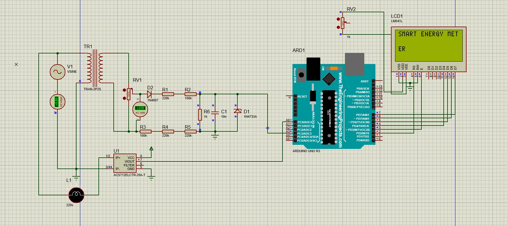
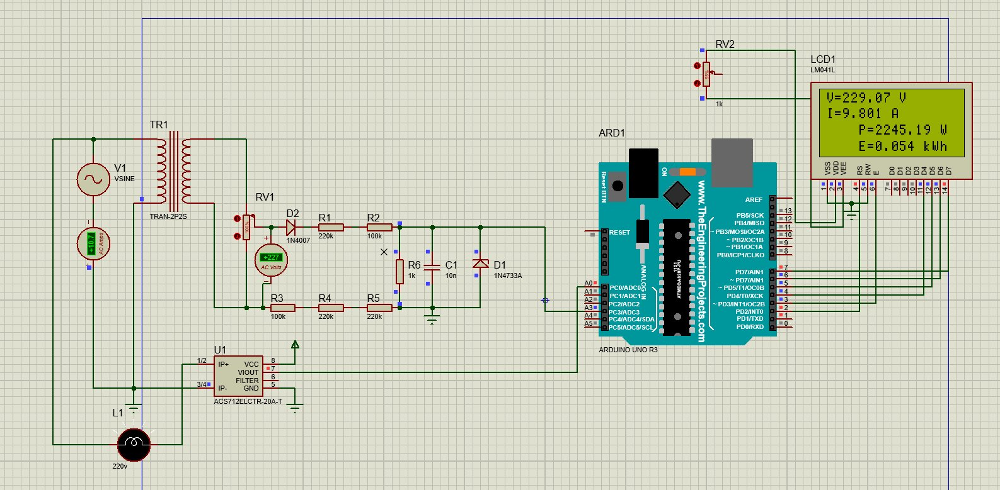
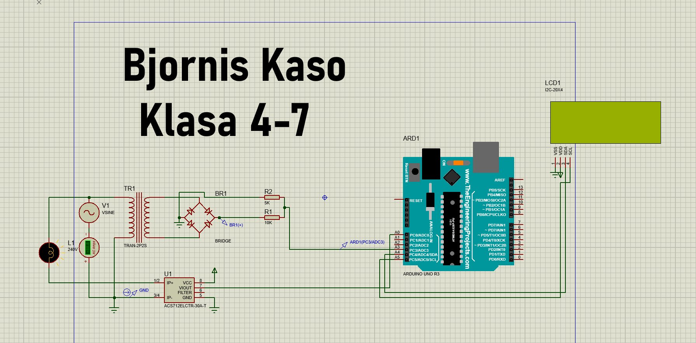
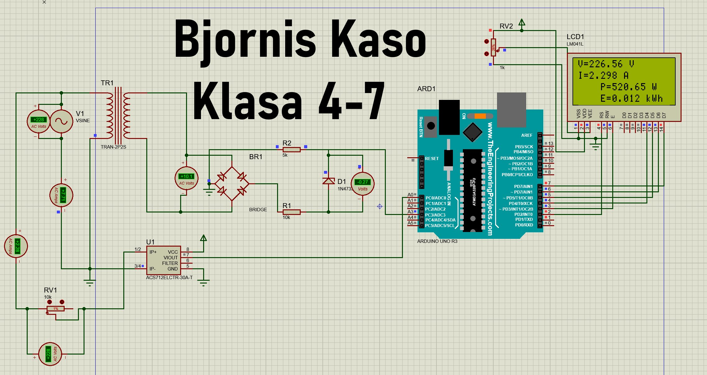
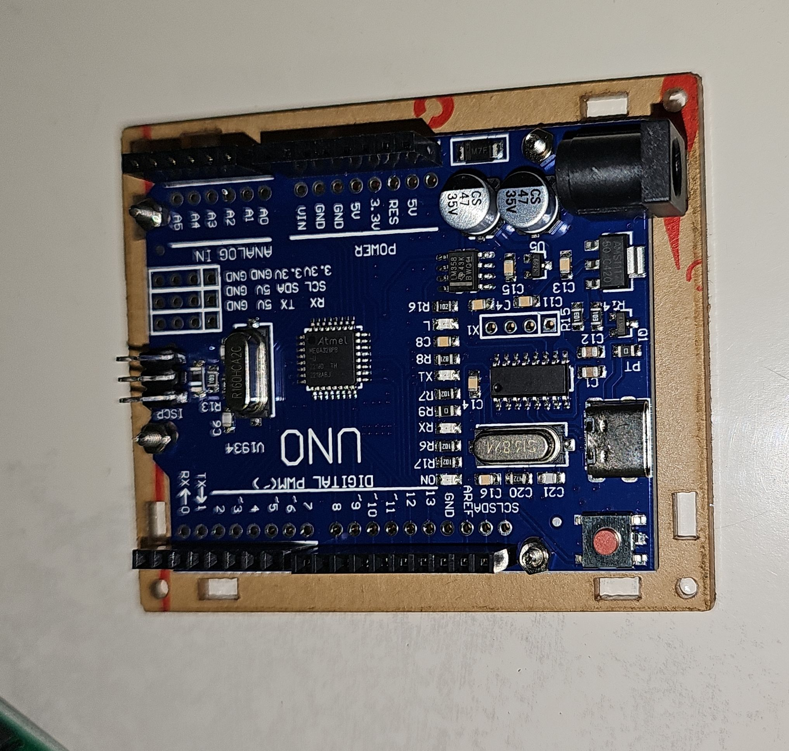
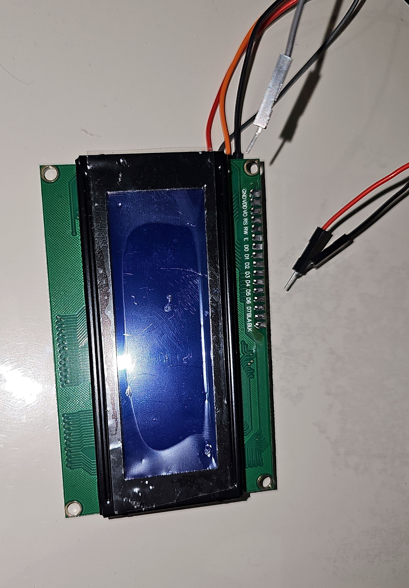
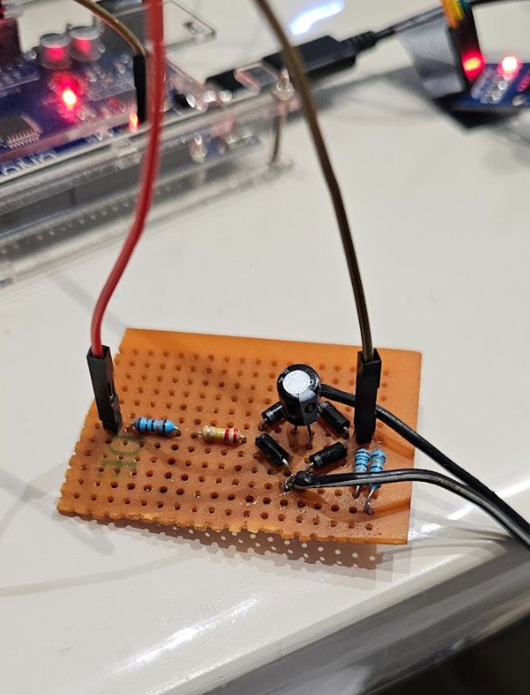
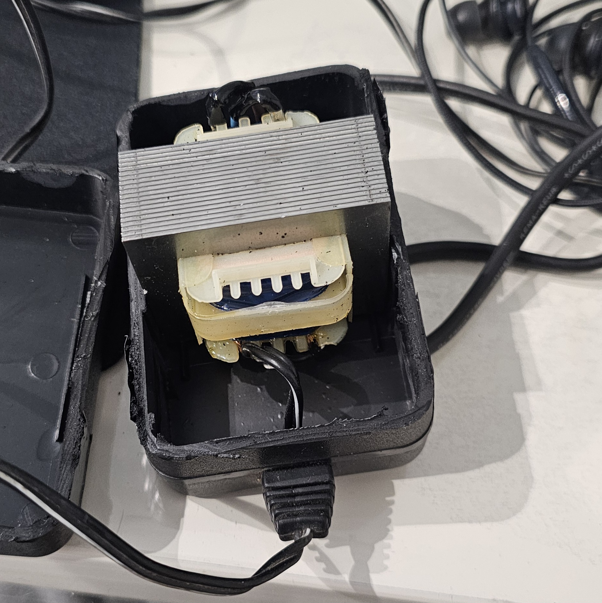
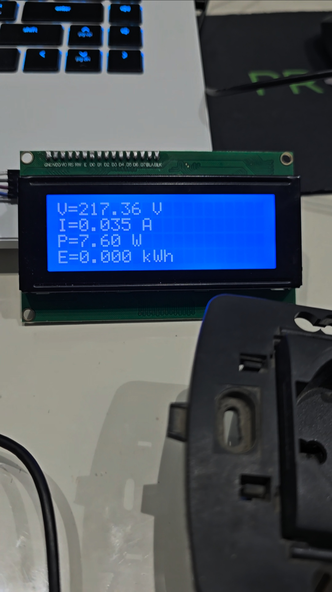

# ⚡ Smart Energy Meter — Matës Smart i Energjisë

An Arduino-based smart energy meter that measures AC voltage, current, active power, and energy consumption in real time, displaying all readings on a 20×4 I²C LCD.

**Project:** Yearly Project 2024–2025  
**School:** Instituti Harry T. Fultz, Tiranë  
**Class:** 4-7 | Branch: Elektronikë & IT  
**Student:** Bjornis Kaso  

---

## 📋 Table of Contents

- [Overview](#overview)
- [Features](#features)
- [Hardware](#hardware)
- [Wiring](#wiring)
- [Software](#software)
- [Schematics](#schematics)
- [Demo Videos](#demo-videos)
- [Calibration Results](#calibration-results)
- [Specifications](#specifications)
- [Project Structure](#project-structure)
- [How to Flash](#how-to-flash)

---

## Overview

This project implements a low-cost smart energy meter using an Arduino Uno. It reads AC voltage via a resistive voltage divider and AC current via an ACS712 Hall-effect sensor, computes RMS values through oversampling, calculates active power (with power factor correction), and accumulates energy in kWh — all displayed live on a 20×4 I²C LCD screen.

---

## Features

- ✅ Real-time RMS voltage measurement (200 V – 240 V range)
- ✅ Real-time RMS current measurement (0 A – 30 A range)
- ✅ Active power calculation (W) with power factor (0.9)
- ✅ Cumulative energy tracking (kWh)
- ✅ 20×4 I²C LCD display
- ✅ Serial monitor output for debugging
- ✅ Calibrated against a reference instrument (error < 1.7%)

---

## Hardware

| Component | Description |
|-----------|-------------|
| Arduino Uno | Microcontroller |
| ACS712 (30A) | Hall-effect current sensor — sensitivity: 66 mV/A |
| Resistive voltage divider | Steps down ~230 V AC to ADC-safe level (ratio ≈ 72.5×) |
| 20×4 I²C LCD (0x27) | Display module |
| Power supply | 5 V regulated for Arduino |

---

## Wiring

| Signal | Arduino Pin |
|--------|-------------|
| Current sensor (ACS712 OUT) | A0 |
| Voltage divider output | A3 |
| LCD SDA | A4 |
| LCD SCL | A5 |

> ⚠️ **Safety Warning:** This device interfaces directly with mains AC voltage. Always use proper insulation, enclosures, and follow electrical safety practices. Do not touch exposed conductors while the circuit is live.

---

## Software

### Source versions

| File | Description |
|------|-------------|
| `src/V1.ino` | Initial prototype — basic RMS measurement, parallel LCD |
| `src/elektronika_V2.ino` | Production version — I²C LCD, offset correction, power factor |
| `simulation/Simulimi_kodi.ino` | Simulation version — parallel LCD, no power factor correction |

### Libraries Required

- `Wire.h` — built-in Arduino I²C library
- `LiquidCrystal_I2C` — for I²C LCD (install via Library Manager: search `LiquidCrystal I2C` by Frank de Brabander)
- `LiquidCrystal` — built-in (used in V1 and simulation)

---

## Schematics

Proteus simulation schematics showing the circuit evolution across versions:

| V1 — Initial schematic | V1 — Simulation running |
|------------------------|------------------------|
|  |  |

| V2 — I²C bridge circuit | V2 — Final simulation |
|-------------------------|-----------------------|
|  |  |

---

## Hardware Photos

| Component | Photo |
|-----------|-------|
| Arduino Uno board |  |
| 20×4 LCD module |  |
| Voltage divider circuit |  |
| Transformer enclosure |  |
| Live LCD reading |  |

---

## Demo Videos

📁 **[View all demo videos on Google Drive](https://drive.google.com/drive/folders/1k67Zs15q0S1eY8mxYWHuzUgEktoVgEQ9?usp=sharing)**

| File | Description |
|------|-------------|
| `demo_simulation_proteus.mp4` | Proteus simulation of the full circuit running |
| `demo_V1_first_power_up.mp4` | First time powering up the V1 hardware prototype |
| `demo_V1_hairdryer_modes.mp4` | Testing V1 with a 2000W hairdryer as load |
| `demo_V1_Soldering_iron.mp4` | Testing V1 measuring a soldering iron |
| `demo_V2_final_prototype_comparison.mp4` | V2 final prototype compared against reference instrument |

---

## Calibration Results

Calibration was performed using the **comparison method** against a reference instrument (Mo) on 10 measurement points across the 224 V – 232 V range.

| Measurement | Max Error (V) | Max Error (A) | Max Error (P) |
|-------------|--------------|--------------|--------------|
| Relative (Grl) | 0.44% | 1.7% | 1.73% |
| Referenced (Grf) | 0.29% | 1.2% | 1.70% |

Full calibration data and charts are in the [`calibration/`](calibration/) folder.

**Accuracy class:** Class 1–2 per IEC 62053-21.

---

## Specifications

| Parameter | Value |
|-----------|-------|
| Voltage range | 200 V – 240 V AC |
| Current range | 0 A – 30 A |
| Power range | 0 W – 7200 W (resistive loads) |
| Max power error | ≤ 1.7% |
| Voltage/current error | ≤ ±0.1% |
| Accuracy class | Class 1 or 2 (IEC 62053-21) |
| Operating temperature | –10 °C to +50 °C |
| Humidity | < 85% RH (non-condensing) |
| IP rating | IPX4 |

### Applicable Standards
- **IEC 62053-21** — Static active energy meters
- **IEC 61010-1** — Safety requirements for measuring equipment
- **IEC 60529** — IP protection classification
- **Albanian Law 124/2015** — Energy efficiency framework

---

## Project Structure

```
smart-energy-meter/
├── README.md
├── CHANGELOG.md
├── src/
│   ├── V1.ino                        # Prototype firmware
│   └── elektronika_V2.ino            # Production firmware (latest)
├── simulation/
│   └── Simulimi_kodi.ino             # Simulation / Tinkercad version
├── calibration/
│   ├── calibration_sheet.md          # Calibration data & analysis
│   └── data.csv                      # Raw measurement data
├── media/
│   ├── schematics/                   # Proteus circuit screenshots
│   └── hardware/                     # Real hardware photos
└── docs/
    └── project_report.md             # Full project documentation
```

---

## How to Flash

1. Install [Arduino IDE](https://www.arduino.cc/en/software)
2. Install the `LiquidCrystal_I2C` library via **Sketch → Include Library → Manage Libraries**
3. Open `src/elektronika_V2.ino`
4. Select board: **Arduino Uno**
5. Select the correct COM port
6. Click **Upload**

---

## License

Academic project — Instituti Harry T. Fultz, 2024–2025.  
May be used as a reference with attribution.
